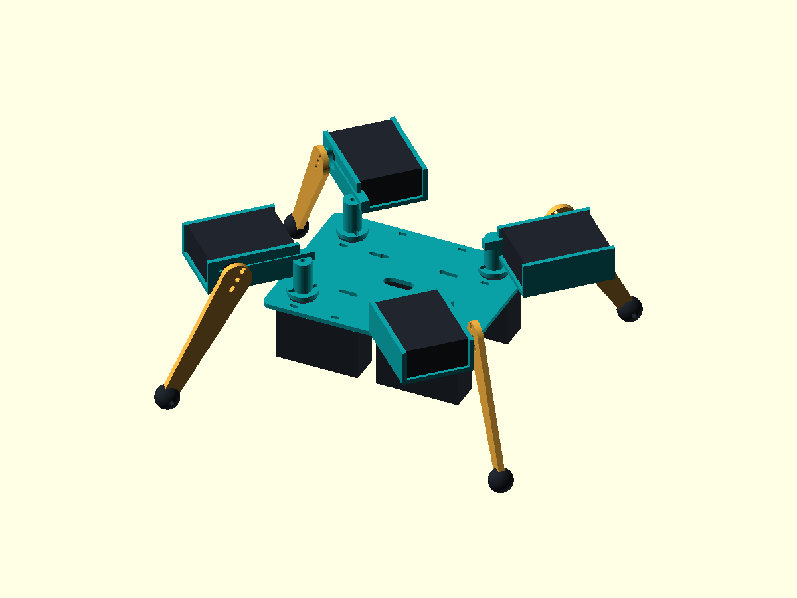

# Mechanical design and assumptions

## Layout

The robot uses four identical leg assemblies. Four upright swing servos sit below a thin deck, two on each side. Their long axes run front-to-back, leaving a central space for the battery and controller. Four carriers rotate above the deck. Each carries a horizontal lift servo, a 90 mm leg, and a 16 mm diameter flexible foot.

| Item | Default |
| --- | --- |
| Deck | 136 × 108 × 3 mm |
| Swing shaft locations | x = ±48 mm, y = ±36 mm |
| Neutral leg headings | Diagonally outward, 45° from the body axes |
| Swing-to-lift shaft spacing | 45 mm radially, 26 mm vertically |
| Lift shaft to foot centre | 90 mm |
| Standing leg angle | 60° below horizontal |
| Foot diameter | 16 mm |
| Payload reservation | 70 × 40 × 22 mm below the centre of the deck |
| Ground clearance below hip servo envelopes | About 15–17 mm in standing simulation |
| Standing footprint | About 245 × 221 mm including feet |
| Standing overall height | About 97 mm |

Coordinates: +X is forward, +Y is left, +Z is up. FL/FR/RL/RR mean front-left, front-right, rear-left, rear-right. Swing is rotation around local Z; lift is around local Y. Positive lift angle points the leg downward. The physical servo neutral positions and directions must be calibrated independently.

The lift motors sit above the deck to clear the fixed swing motors. This accepts some height in exchange for simpler carriers and a smaller body plan. The servo envelopes, battery bay, and short direct-drive legs replace the large modular housings, paired motors, wheel mechanisms, and bearings in the original project. Standard-size Parallax servos set a limit on further miniaturisation.

## Servo dimensions and evidence

Source: [Parallax's digital Standard Servo guide, version 3.0, hosted by DigiKey](https://mm.digikey.com/Volume0/opasdata/d220001/medias/docus/5728/900-00005_Guide.pdf).

The guide gives an approximate overall size of 2.2 × 0.8 × 1.6 inches, excluding the horn. We reserve **55.8 × 20.3 × 40.6 mm** per servo. This includes the flange envelope, so the simulation's rectangular blocks are larger than the actual narrow casing in some places. The printed metric width in the guide differs from the inch conversion; the larger 20.3 mm value is used for layout.

The digital version's listed mass is 42 g. Its 6 V torque figure converts to approximately 0.268 Nm, and the listed no-load speed is 0.19 seconds per 60°. The model uses a lower, **assumed 0.16 Nm limit**, plus a linear torque-speed falloff. Neither this derating nor the controller gains are measured continuous-duty specifications.

**The 14 mm shaft offset is an unverified layout assumption.** The guide is not a detailed mounting drawing. Horn thickness, spline seating, mounting-hole positions, cable exit, and screw dimensions must be measured on the actual servo. The CAD uses straps and adjustable horn slots as prototype mounting provisions, rather than asserting an exact flange-hole pattern. The older analog servo has the same part number; identify the actual version before using the digital model's performance values.

## Prototype parts

Edit parts in Onshape or Fusion and export `deck.stl`, `carrier.stl`, `leg.stl`, and `foot.stl` into `cad/` in millimetres. Keep the editable CAD in your CAD tool. Match the coordinate conventions below when replacing parts; arbitrary assembly exports may need changes to the importer mapping. Update `robot.json` separately when physical dimensions or masses change.

Run `python build_robot.py` to rebuild the saved simulation model and its mesh assets. The builder preserves the source STL files.

The viewer reads `cad/*.stl` afresh on every launch, so replacement files appear after a restart. ASCII and binary STL are accepted. The saved `models/robot.xml` references converted binary meshes in `models/meshes/`; rebuild it after replacing a source mesh if you use the XML directly in other MuJoCo tools. The viewer generates equivalent XML in memory and does not depend on this saved copy.

### Mesh coordinates and joints

The importer reverses the supplied STLs' printing transforms, then scales millimetres to metres. Preserve these export transforms and units when editing or replacing parts:

| STL | Print transform applied by CAD | Simulation attachment |
| --- | --- | --- |
| Deck | Translate up by `plate` | Fixed chassis; deck top is local Z = 0 |
| Carrier | Translate down 2 mm | Swing joint; shaft axis is local Z through the origin |
| Leg | Rotate +90 degrees about X, then translate down 2 mm | Lift joint; shaft axis is local Y through the origin |
| Foot | Translate up by `foot_radius` | Leg tip at local `[leg_length, 4, 0]` mm |

An STL does not contain joint definitions. The XML still defines the eight joint axes, limits, actuators, and rigid-body hierarchy. The carrier rotates with the swing servo, while the leg and foot rotate together with the lift servo. The servo envelopes stay on their respective fixed mounting bodies. Avoid slicer auto-centering or a new export origin unless you also change the importer mapping.

Detailed mesh geoms use group 2 with zero mass and no contact flags. The original collision/mass proxies use group 3 and are hidden by default; press **C** to inspect them. This avoids counting the printed part's mass twice. Motor and payload boxes remain visible because separate CAD meshes for those purchased parts are not supplied.

Changing STL shape alone does not resize collision geometry or update mass/inertia. After a dimensional change, update `robot.json` and, where the shape changes substantially, the proxy geometry in `build_robot.py`. Re-export the parts after changing shared dimensions so the joint layout and mesh dimensions agree. The checks validate proxy clearances, not exact mesh-to-mesh interference or printed-part strength.

| STL | Quantity | Intended attachment |
| --- | --- | --- |
| `deck.stl` | 1 | Four underside servo positions with shaft access holes and strap slots; central battery strap slots |
| `carrier.stl` | 4 | Horn plate and riser connected to a lift-servo cradle; adjustable horn slots and servo retaining straps |
| `leg.stl` | 4 | Flat link with a horn plate, adjustable attachment slots, and a foot fastener hole |
| `foot.stl` | 4 | Flexible cap with a slot for the leg tip and a transverse retaining fastener |

Use the servo's supplied horns, secured to the printed horn plates; no printable replacement spline is claimed. The shaft access holes permit assembly access. The deck's underside servos and the carrier servos require straps or equivalent clamps. The CAD intentionally leaves their exact fasteners and the electronics mounts to be selected after measuring the parts.

The deck and legs have flat export orientations. Carriers have overhangs and may need supports or reorientation; flexible feet need a suitable flexible material and fit trial. The files are a starting point for fit prototypes, not print-and-assemble instructions. Check that straps clear moving horns, that screws remain accessible, and that wiring can flex throughout the gait.

Before printing a full set, measure one servo and horn, update the configuration and mounting geometry, and make one carrier/leg fit sample. Check the resulting travel by hand. The model checks the configured walking motion, not every possible combination of manual joint angles or cable positions.

## Simulation assumptions

The body, servo envelopes, cradle, and legs use simple collision solids. The CAD has openings, walls, horn holes, and strap passages that are simplified in physics. Adjacent parts have intentional mechanical connections; the check explicitly inspects moving motor/leg envelopes against the fixed deck, payload, and motor envelopes because MuJoCo normally filters parent-child contacts.

Estimated mass breakdown:

| Parts | Mass |
| --- | --- |
| Eight servo envelopes | 336 g |
| Deck | 45 g |
| Battery/controller allowance | 100 g |
| Four carriers and risers | 48 g |
| Four legs | 32 g |
| Four feet | 12 g |
| **Total** | **573 g** |

Only the servo mass is a manufacturer figure. Other values are editable estimates, not measured or sliced part masses. The payload block is a reservation, not a selected battery, regulator, or controller. Hardware, cables, print density, and fasteners may change the total significantly.

The gait is an open-loop crawl with 80% commanded stance duty. Only one leg is commanded to lift at once; actual ground contacts depend on the physics. Forward movement follows from friction and the eight motor torques. No fixed-base constraint, hidden support, direct chassis translation, reinforcement learning, or balance stabilisation is used. The robot can fall if its parameters are changed.

The controller and collision model omit servo backlash, detailed compliance, supply-voltage sag, heat, current sharing, foot wear, and sensor noise. A real build needs an adequate servo supply, mechanical verification, and calibration of each servo's centre, direction, and safe travel. This repository provides no electrical design or hardware-driving firmware.
